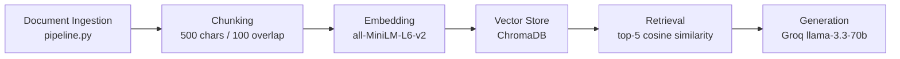

# Project 1 Planning: The Unofficial Guide

> Write this document before you write any pipeline code.
> Your spec and architecture diagram are what you'll use to direct AI tools (Claude, Copilot, etc.) to generate your implementation — the more specific they are, the more useful the generated code will be.
> Update the Retrieval Approach and Chunking Strategy sections if you change your approach during implementation.
> Update this file before starting any stretch features.

---

## Domain

This guide covers The Legend of Zelda: Tears of the Kingdom — including its story, lore, characters, abilities, and gameplay mechanics. This knowledge is valuable because the official Nintendo materials don't explain the narrative depth, character motivations, or practical gameplay strategies. Players rely on community wikis, Reddit breakdowns, and fan guides to actually understand what's happening in the game and how to play it effectively.

---

 ## Documents

| # | Source | Description | URL or location |
|---|--------|-------------|-----------------|
| 1 | Zelda Fandom Wiki | General game information overview | https://zelda.fandom.com/wiki/The_Legend_of_Zelda:_Tears_of_the_Kingdom#Game_Information |
| 2 | Reddit r/truezelda | Community story breakdown and analysis | https://www.reddit.com/r/truezelda/comments/13l35ak/totk_botw_totk_complete_story_overhaul_and/ |
| 3 | Zelda Fandom Wiki | Full plot summary | https://zelda.fandom.com/wiki/The_Legend_of_Zelda:_Tears_of_the_Kingdom#Plot |
| 4 | Fextralife Wiki | All player abilities explained | https://zeldatearsofthekingdom.wiki.fextralife.com/Abilities |
| 5 | Inverse | Ending explained with spoilers | https://www.inverse.com/gaming/zelda-tears-kingdom-ending-explained-spoilers |
| 6 | Game8 | Weapon fusing guide | https://game8.co/games/Zelda-Tears-of-the-Kingdom/archives/409353 |
| 7 | CBR | Tips and tricks for completing shrines | https://www.cbr.com/zelda-totk-tricks-complete-shrines/ |
| 8 | Screen Rant | Why Zelda turned into a dragon | https://screenrant.com/zelda-totk-why-turned-into-dragon-secret-stone/ |
| 9 | Hyrule Archive | Sages guide — who they are and their powers | https://hyrulearchive.com/tears-of-the-kingdom/guide/sages-guide |
| 10 | Nintendo Life | Beginner tips — what to do first | https://www.nintendolife.com/guides/zelda-tears-of-the-kingdom-beginners-tips-what-to-do-first |

## Chunking Strategy

**Chunk size:** 500 characters

**Overlap:** 100 characters

**Reasoning:** Documents range from short Reddit paragraphs to longer wiki and guide articles. 500 characters captures enough context for a meaningful semantic unit (a few sentences) without diluting the embedding with unrelated content. 100-character overlap ensures that facts spanning two adjacent chunks aren't lost — for example, a sentence explaining Zelda's transformation that begins at the end of one chunk and completes at the start of the next will still be retrievable.
---

## Retrieval Approach

**Embedding model:** all-MiniLM-L6-v2 via sentence-transformers (runs locally, no API key)

**Top-k:** 5 chunks per query

**Production tradeoff reflection:** For a real deployment I would consider OpenAI's text-embedding-3-large for higher accuracy on domain-specific text, or a multilingual model if the user base includes non-English speakers. The tradeoff is cost and latency vs. quality. all-MiniLM-L6-v2 is fast and free but has a 256-token context limit, which could truncate longer chunks. A production system might also use a larger context model like text-embedding-ada-002 to handle full paragraphs without truncation.
---

## Evaluation Plan

| # | Question | Expected answer |
|---|----------|-----------------|
| 1 | Why did Zelda turn into a dragon? | Zelda swallowed a secret stone and sacrificed herself to revive the Master Sword, transforming into the Light Dragon |
| 2 | Who is Ganondorf and what is his backstory in TotK? | Ganondorf was a Gerudo king who discovered a secret stone, became the Demon King, and was imprisoned by Rauru beneath Hyrule |
| 3 | What are the four main abilities Link has in TotK? | Ultrahand, Fuse, Ascend, and Recall |
| 4 | What is the best strategy for completing shrines efficiently? | Use Ascend to skip sections, look for hidden rooms, and prioritize light of blessing shrines for heart containers |
| 5 | Who are the five sages and what powers do they grant? | Tulin (wind), Sidon (water), Yunobo (fire), Riju (lightning), and Mineru (spirit/construct) |

---

## Anticipated Challenges

1. **Chunk boundary splits:** Story explanations (like Zelda's dragon transformation) 
span multiple sentences across sources. A key fact may be split across two chunks, 
causing retrieval to return only half the context the LLM needs to answer correctly.

2. **Source overlap and contradiction:** Multiple documents cover the same events 
(e.g. the ending) from different angles. Retrieved chunks may contain slightly 
contradictory descriptions, which could confuse the LLM or produce a blended answer 
that doesn't match any single source precisely.

---

## Architecture

---

## AI Tool Plan

**Milestone 3 — Ingestion and chunking:**
I will give Claude my Chunking Strategy section and Documents list and ask it to implement pipeline.py with load_documents(), clean_text(), and chunk_text() using 500-char chunks with 100-char overlap. I will verify the output by running it and inspecting 5 sample chunks.

**Milestone 4 — Embedding and retrieval:**
I will give Claude my Retrieval Approach section and pipeline diagram and ask it to implement embeddings.py using all-MiniLM-L6-v2 and ChromaDB with cosine similarity. I will verify by checking that distance scores on test queries are below 0.5.

**Milestone 5 — Generation and interface:**
I will give Claude my grounding requirement and evaluation questions and ask it to implement query.py with a system prompt that strictly limits answers to retrieved context, and app.py as a Gradio interface. I will verify that out-of-scope questions return a refusal response.
